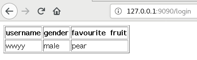

# go_web
## 任务要求

编程 web 应用程序 cloudgo-io。

基本要求

 -   支持静态文件服务
 -   支持简单 js 访问
 -   提交表单，并输出一个表格
 -   对 /unknown 给出开发中的提示，返回码 5xx

 ###  支持静态文件服务
 关键代码:
 ```
    wd, err := os.Getwd()
	fmt.Println("wd", wd)
	if err != nil {
		log.Fatal(err)
	}
    fsh := http.FileServer(http.Dir(wd))
	http.Handle("/static", http.StripPrefix("/static", fsh))
```


### 支持简单 js 访问
- 主要代码
```
http.HandleFunc("/login", login) //设置访问的路由

func login(w http.ResponseWriter, r *http.Request) {
    //对应的具体处理逻辑见main.go
}

```


###  提交表单，并输出一个表格
- 主要代码：
```
r.ParseForm()
		if len(r.Form["username"][0]) == 0 {
			//为空的处理
			fmt.Println("username cannot be empty")
		}
        //检查用户提交数据是否合法
		slice := []string{"apple", "pear", "banana"
		v := r.Form.Get("fruit")
		for _, item := range slice {
			if item == v {
				fmt.Println("fruit", item)
			}
		}
		slice = []string{"1", "2"}
		for _, v := range slice {
			if v == r.Form.Get("gender") {
				fmt.Println("gender get", reflect.TypeOf(v))
			}
		}
		fmt.Println("r", r)
		fmt.Println("username:", r.Form["username"])
		fmt.Println("password:", r.Form["password"])
		user := User{Username: r.Form["username"][0],
			Fruit:  r.Form.Get("fruit"),
			Gender: r.Form.Get("gender")}
		t := template.New("foo")
		t = t.Funcs(template.FuncMap{"gender": GetGenderByNum})
		t, _ = t.Parse(`{{define "T"}}
		<table border="1">
		<tr>
			<th>username</th>
			<th>gender</th>
			<th>favourite fruit</th>
		</tr>
		<tr>
			<td>{{.Username}}</td>
			<td>{{.Gender|gender}}</td>
			<td>{{.Fruit}}</td>
		</tr>
	</table> 
			{{end}}
			`)
		err := t.ExecuteTemplate(w, "T", user)
		if err != nil {
			fmt.Println("err", err)
		}
```


### 对 /unknown 给出开发中的提示，返回码 5xx
- 主要代码：
```
http.HandleFunc("/", unknown) 

func unknown(w http.ResponseWriter, r *http.Request) {
	r.ParseForm() //解析url传递的参数，对于POST则解析响应包的主体（request body）
	//注意:如果没有调用ParseForm方法，下面无法获取表单的数据
	fmt.Println(r.Form) //这些信息是输出到服务器端的打印信息
	fmt.Println("path", r.URL.Path)
	fmt.Println("scheme", r.URL.Scheme)
	fmt.Println(r.Form["url_long"])
	for k, v := range r.Form {
		fmt.Println("key:", k)
		fmt.Println("val:", strings.Join(v, ""))
	}
	fmt.Fprintf(w, "501 unknown") //这个写入到w的是输出到客户端的
}
```

